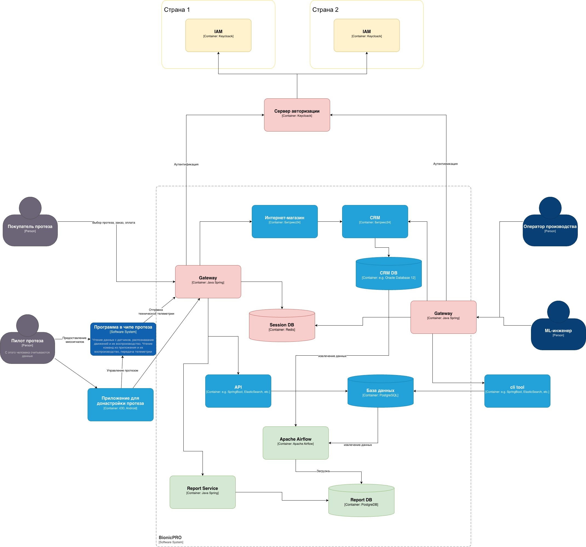
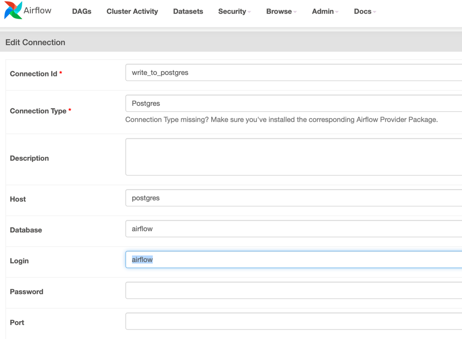
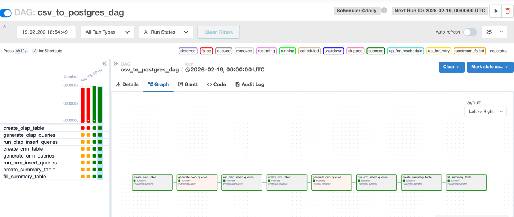
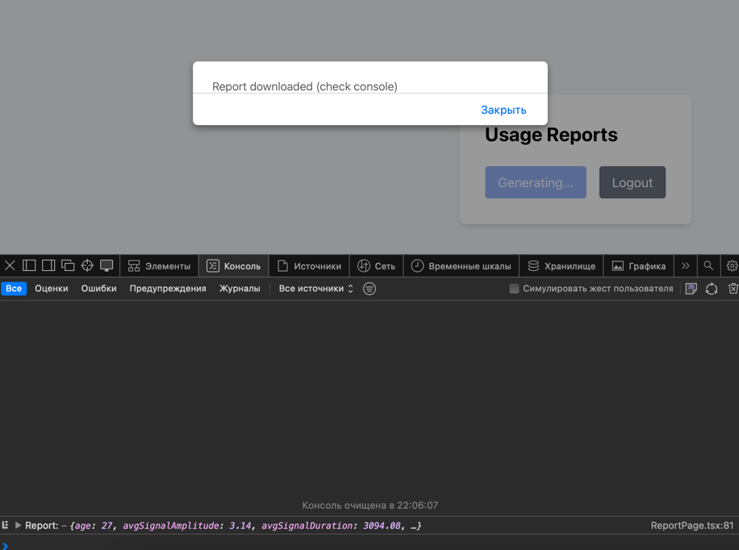
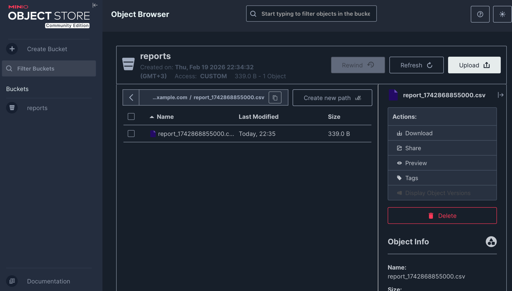
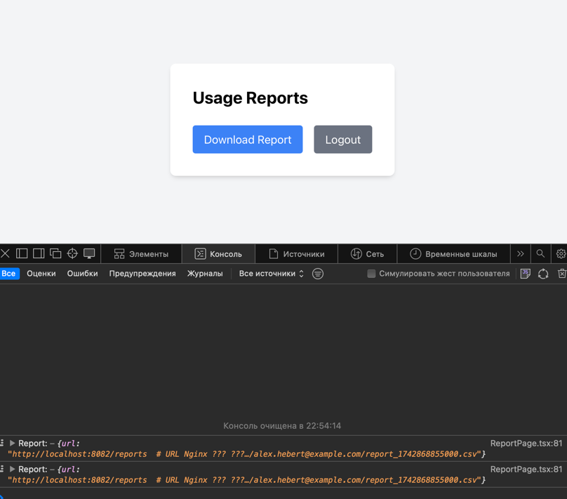

# Сдача проектной работы 9 спринта
## Задание 1. Повышение безопасности системы

### Задача 1. Предложите архитектурное решение и доработайте диаграмму C4 для управления учётными данными пользователя.

### AS IS


### TO BE


### Задача 2. Улучшите безопасность существующего приложения, заменив Code Grant на PKCE.

Доработка файла realm-export.json, добавить атрибут для clients :

```
      {
        "clientId": "reports-frontend",
        ...
        "attributes": {
          "pkce.code.challenge.method": "S256"
        }
      },
```

Доработать App.tsx, включить добавление code_challenge и code_challenge_method в блок initOptions для keycloak:

```
            initOptions={{
                onLoad: 'check-sso',
                pkceMethod: 'S256',  // <--- Включаем PKCE с SHA-256
                flow: 'standard',
                checkLoginIframe: false,
            }}
```

```shell
# Запускаем контейнер
docker compose up -d 

```

Чтобы зайти в админку keycloak:
```shell
# Зайти в контейнер
docker exec -it  architecture-bionicpro-keycloak-1 bash

# Временно отключить HTTPS
/opt/keycloak/bin/kcadm.sh config credentials \
--server http://localhost:8080 \
--realm master --user admin --password admin

# Для всех realms
/opt/keycloak/bin/kcadm.sh update realms/master -s sslRequired=none
/opt/keycloak/bin/kcadm.sh update realms/reports-realm -s sslRequired=none

exit
```

### Задача 3. Обеспечьте безопасное получение и хранение access-и refresh-токенов.

#### Реализован сервис на Java - bionicpro-auth.
Реализованы ендпоинты:
- /login - для аутентификации
- /status - для проверки статуса аутентификации
- /api/report - тестовый отчет для проверки UI и работы бека

#### Доработан файл кейклока:

```
    "accessTokenLifespan": 60,
    "ssoSessionIdleTimeout": 1800,
    "ssoSessionMaxLifespan": 36000,
```
#### Доработано приложнеие по фронтенду:

- интеграции с bionicpro-auth,
- убран механизм получения токенов
- сделано прокидывание на бэкенд сессионной cookie.

#### Тестирование

Удалить папку для БД - postgres-keycloak-data

Перезапустить приложение:
```shell
docker compose down -v 
# Запускаем контейнер
docker compose up --build -d
```

Логи из bionicpro-auth:

Демонстрация:
- проверки токена
- обновления токена
- ротации ИД сессии

```
2026-02-15T20:30:23.491Z  INFO 1 --- [bionicpro-auth] : Проверка токена для сессии 15BCAE94657F44F6F5C440028DCD8FB2

2026-02-15T20:30:23.492Z  INFO 1 --- [bionicpro-auth] : Токен 15BCAE94657F44F6F5C440028DCD8FB2, время жизни Sun Feb 15 20:30:29 UTC 2026

2026-02-15T20:30:31.720Z  INFO 1 --- [bionicpro-auth] : Проверка токена для сессии 15BCAE94657F44F6F5C440028DCD8FB2

2026-02-15T20:30:31.721Z  INFO 1 --- [bionicpro-auth] : Токен 15BCAE94657F44F6F5C440028DCD8FB2, время жизни Sun Feb 15 20:30:29 UTC 2026

2026-02-15T20:30:31.721Z  INFO 1 --- [bionicpro-auth] : Обновляем токен

2026-02-15T20:30:31.723Z  INFO 1 --- [bionicpro-auth] : refreshToken eyJhbGciOiJIUzI1NiIsInR5cCIgOiAiSldUIiwia2lkIiA6ICJjOGIxNzZlYi1hYmJlLTRmOGItYmQxYS02Yjk1YTk1M2Q0NWUifQ.eyJleHAiOjE3NzExODkxNjksImlhdCI6MTc3MTE4NzM2OSwianRpIjoiMTA5YjRhYjItZWJkZS00OTI3LTk0ZjQtZjEwZWE4MmNkMWU2IiwiaXNzIjoiaHR0cDovL2tleWNsb2FrOjgwODAvcmVhbG1zL3JlcG9ydHMtcmVhbG0iLCJhdWQiOiJodHRwOi8va2V5Y2xvYWs6ODA4MC9yZWFsbXMvcmVwb3J0cy1yZWFsbSIsInN1YiI6ImNjZDA1NGI2LTViNTQtNDQxZS1iZjA3LTM3MjE5NTc4ZDVlNSIsInR5cCI6IlJlZnJlc2giLCJhenAiOiJyZXBvcnRzLWZyb250ZW5kIiwic2Vzc2lvbl9zdGF0ZSI6ImEzY2QxYzkzLTc1ODktNGFjOC1iOGZkLWIwM2VjZWEyYzU3YyIsInNjb3BlIjoicHJvZmlsZSBlbWFpbCIsInNpZCI6ImEzY2QxYzkzLTc1ODktNGFjOC1iOGZkLWIwM2VjZWEyYzU3YyJ9.tCRUpEbf_yc0mIFjgXsqLw3_MQhwZikZA_ahS9ZWyKc

2026-02-15T20:30:31.795Z  INFO 1 --- [bionicpro-auth] : newTokens AccessToken eyJhbGciOiJSUzI1NiIsInR5cCIgOiAiSldUIiwia2lkIiA6ICI4Sm5kM2ExOFVsUGljY2ExM180aDZxbXlJTkJ1RU9FSktpX1huRW1Jai00In0.eyJleHAiOjE3NzExODc0OTEsImlhdCI6MTc3MTE4NzQzMSwianRpIjoiYzJiMjgwM2ItNjFiYS00Nzc5LWJiYWQtOTFjMmQzYThkODdhIiwiaXNzIjoiaHR0cDovL2tleWNsb2FrOjgwODAvcmVhbG1zL3JlcG9ydHMtcmVhbG0iLCJzdWIiOiJjY2QwNTRiNi01YjU0LTQ0MWUtYmYwNy0zNzIxOTU3OGQ1ZTUiLCJ0eXAiOiJCZWFyZXIiLCJhenAiOiJyZXBvcnRzLWZyb250ZW5kIiwic2Vzc2lvbl9zdGF0ZSI6ImEzY2QxYzkzLTc1ODktNGFjOC1iOGZkLWIwM2VjZWEyYzU3YyIsImFjciI6IjEiLCJhbGxvd2VkLW9yaWdpbnMiOlsiaHR0cDovL2xvY2FsaG9zdDozMDAwIl0sInJlYWxtX2FjY2VzcyI6eyJyb2xlcyI6WyJ1c2VyIl19LCJzY29wZSI6InByb2ZpbGUgZW1haWwiLCJzaWQiOiJhM2NkMWM5My03NTg5LTRhYzgtYjhmZC1iMDNlY2VhMmM1N2MiLCJlbWFpbF92ZXJpZmllZCI6ZmFsc2UsIm5hbWUiOiJVc2VyIE9uZSIsInByZWZlcnJlZF91c2VybmFtZSI6InVzZXIxIiwiZ2l2ZW5fbmFtZSI6IlVzZXIiLCJmYW1pbHlfbmFtZSI6Ik9uZSIsImVtYWlsIjoidXNlcjFAZXhhbXBsZS5jb20ifQ.PTiQU97hFL6VfBn6ytFyyyCDDNlwlY-Q8cUKOtSTofTod83_IVDvKZuwhfxC6LZyu1o3iDi1u7ZNfZjVKyi6t3gCK4uj0C-BttIfZmohsAFrYHVhHlz7PBvB_aqU1FgzYveit5poqZ3eVk3s9cD7qCZVISvTacOCx3rQELd6bJl6DNFfkeRtqH6AngfqANuS98sNc15KaU-yR68VxHOaLLg7f5DCuwdJx9OqZeDhGRwjltS6Nn7-7B_YznNCk17_uC_roeLKGjI9rEj2eUIa-5JKJc3exctObt0XFPke1KQGxU3CB3n-hNFlMUsJlsDs_3ItqqWeOy6k4wo367yvMQ , RefreshToken eyJhbGciOiJIUzI1NiIsInR5cCIgOiAiSldUIiwia2lkIiA6ICJjOGIxNzZlYi1hYmJlLTRmOGItYmQxYS02Yjk1YTk1M2Q0NWUifQ.eyJleHAiOjE3NzExODkyMzEsImlhdCI6MTc3MTE4NzQzMSwianRpIjoiM2E5MjZiMWUtZTY5OS00M2M0LThhNzQtZDUxODJkOTVhZDViIiwiaXNzIjoiaHR0cDovL2tleWNsb2FrOjgwODAvcmVhbG1zL3JlcG9ydHMtcmVhbG0iLCJhdWQiOiJodHRwOi8va2V5Y2xvYWs6ODA4MC9yZWFsbXMvcmVwb3J0cy1yZWFsbSIsInN1YiI6ImNjZDA1NGI2LTViNTQtNDQxZS1iZjA3LTM3MjE5NTc4ZDVlNSIsInR5cCI6IlJlZnJlc2giLCJhenAiOiJyZXBvcnRzLWZyb250ZW5kIiwic2Vzc2lvbl9zdGF0ZSI6ImEzY2QxYzkzLTc1ODktNGFjOC1iOGZkLWIwM2VjZWEyYzU3YyIsInNjb3BlIjoicHJvZmlsZSBlbWFpbCIsInNpZCI6ImEzY2QxYzkzLTc1ODktNGFjOC1iOGZkLWIwM2VjZWEyYzU3YyJ9.EtUlI4uMDkALssZLXFOoqUY7B583hpq8k6umtIeOkok

2026-02-15T20:30:31.796Z  INFO 1 --- [bionicpro-auth] : Ротация для сессии 15BCAE94657F44F6F5C440028DCD8FB2, новый ИД сессии 580CD863E3A7DEB5C89EEA7134833D6C

2026-02-15T20:30:49.748Z  INFO 1 --- [bionicpro-auth] : Проверка токена для сессии 580CD863E3A7DEB5C89EEA7134833D6C

2026-02-15T20:30:49.749Z  INFO 1 --- [bionicpro-auth] : Токен 580CD863E3A7DEB5C89EEA7134833D6C, время жизни Sun Feb 15 20:31:31 UTC 2026
```

### Задача 4. Добавьте LDAP для возможности получения данных о пользователях представительства BionicPRO в другой стране.

#### Добавим в докер компоус сервис openldap

```
  openldap:
    image: osixia/openldap:latest
    container_name: openldap
    ...
```

Перезапустить приложение:
```shell
docker compose down -v 
# Запускаем контейнер
docker compose up --build -d
```

#### Настраиваем кейклок


### Задача 5. Настройте MFA

#### Добавляем настройку ОТП


#### Добавляем настройку ОТП для пользователя


#### Результат при входе


### Задача 6. Добавьте OAuth 2.0 от Яндекс ID.

#### Поменяем кейклок на российский и добавим необходимые библиотеки:
```
  keycloak:
    image: playaru/keycloak-russian:21.1.1
    platform: linux/amd64
    ...
    volumes:
    ...
      - ./keycloak/providers:/opt/keycloak/providers
```

#### Настроим яндекс ID


#### Настроим кейклок


#### Проверка входа


#### Проверка появления пользователя в БД кейклока


#### Итоговый realm

[realm-export.json](Task1/realm-export.json)

## Задание 2. Разработка сервиса отчётов

### Задача 1. Создать архитектуру решения для подготовки и получения отчётов.



### Задача 2. Разработать Airflow DAG и настроить его на запуск по расписанию.

В docker-compose.yaml добавлены все необходимые сервисы для Airflow
```
x-airflow-common: &airflow-common
  build:
    context: ./Task2
    dockerfile: Dockerfile
    
    .....
    
services:    
  postgres:
    image: postgres:16.0
    volumes:
    
    .....
    
  airflow-webserver:
    <<: *airflow-common

    .....
    
  airflow-scheduler:
    <<: *airflow-common
    
    .....
    
  airflow-triggerer:
    <<: *airflow-common
    
    .....
    
  airflow-cli:
    <<: *airflow-common
    
    .....  
    
  airflow-init:
    <<: *airflow-common
```

В дериктории Task2 добавлены файлы для инициализиции БД и миграции данных, а также скрипт dag [dag_sample](Task2/dags/dag_sample.py)

Переходим в Airflow по http://localhost:8081 и настраиваем коннектор для записи в БД:



Запускаем Процесс для миграции данных в БД, а также трансформацию и наполнение таблицы отчетов:



Структура таблицы отчетов:

```
            CREATE TABLE IF NOT EXISTS customer_telemetry_summary (
                                                                      user_id INTEGER PRIMARY KEY,
                                                                      name VARCHAR(100),
                email VARCHAR(100),
                age NUMERIC,
                gender VARCHAR(10),
                country VARCHAR(100),
                prosthesis_types TEXT[],               -- список типов протезов
                total_signals INTEGER,                  -- общее количество сигналов
                avg_signal_frequency DECIMAL(10,2),    -- средняя частота
                avg_signal_duration DECIMAL(10,2),      -- средняя длительность
                avg_signal_amplitude DECIMAL(10,2),     -- средняя амплитуда
                min_signal_time TIMESTAMP,              -- первый сигнал
                max_signal_time TIMESTAMP,               -- последний сигнал
                last_signal_time TIMESTAMP               -- дубль для удобства
                );
```

### Задача 3. Создайте бэкенд-часть приложения для API.

Для упрощения реализация получения отчета сделана в том же сервисе, через который идет авторизация.

Доработан контроллер бек приложения для подключения к БД и выгрузке отчета пользователю:

```java
        String sql = """
                SELECT user_id, name, email, age, gender, country,
                       prosthesis_types, total_signals,
                       avg_signal_frequency, avg_signal_duration, avg_signal_amplitude,
                       min_signal_time, max_signal_time, last_signal_time
                FROM customer_telemetry_summary
                WHERE email = ?
                """;

            ReportDto report = jdbcTemplate.queryForObject(sql, new ReportRowMapper(), email);
            return ResponseEntity.ok(report);
```


### Задача 4. Реализуйте ограничение доступа к эндпоинту отчётности.

Для ограничения доступа, при получении jwt токена, сохраняем информацию о пользователе в сессии:

```java

// Извлекаем email из access token
String email = jwtUtils.extractEmail(tokens.getAccessToken());
            session.setAttribute("email", email);
```

Для получения отчета, получаем информацию о пользователе не из парамтеров запроса, а из данных сессии,
таким образом, клиент не сможет получить отчеты других пользователей:

```java
    @GetMapping("/report")
public ResponseEntity<?> getReport(HttpSession session) {
    String email = (String) session.getAttribute("email");
    if (email == null) {
        return ResponseEntity.status(401).body("User email not found in session");
    }
```

### Задача 5. Добавьте в UI кнопку получения отчёта и вызова эндпоинта его генерации.

Доработан UI для загразки отчета.

Для простоты изменил в KeyClock email существующего пользователя user1 на alex.hebert@example.com, чтобы получить существующий в БД отчет.



## Задание 3. Снижение нагрузки на базу данных

Добавляем в docker-compose.yaml minio и nginx

```
  minio:
    image: minio/minio
....

  nginx:
    image: nginx:alpine
```

Конфигурацию для nginx положим в [nginx](Task3/nginx/nginx.conf)

Доработаем приложение, метод получения отчета:

```java
        // 1. Получаем только дату последнего сигнала для версионирования
String versionSql = "SELECT max_signal_time FROM customer_telemetry_summary WHERE email = ?";
Timestamp maxSignalTime;
maxSignalTime = jdbcTemplate.queryForObject(versionSql, Timestamp.class, email);

long version = maxSignalTime != null ? maxSignalTime.getTime() : System.currentTimeMillis();
String objectName = String.format("reports/%s/report_%d.csv", email, version);

// 2. Проверяем наличие в Minio
if (!minioService.objectExists(objectName)) {
// Файла нет – генерируем, запросив полные данные
Map<String, Object> fullData = fetchFullData(email);
byte[] csvData = generateCsv(fullData);
            minioService.uploadFile(objectName, csvData, "text/csv");
            log.info("Generated new report for {}: {}", email, objectName);
        }

String fileUrl = minioService.getPublicUrl(objectName);
        return Map.of("url", fileUrl);
```

Пояснение:

- Лёгкий запрос к БД – получаем только max_signal_time, чтобы определить версию. Это быстро и не нагружает базу.
- Проверка Minio – если файл с версией уже существует, сразу возвращаем ссылку. БД больше не трогается.
- Генерация при необходимости – если файла нет, запрашиваем полные данные из БД, генерируем CSV, загружаем в Minio.
- Актуальность – версия привязана к max_signal_time. Если данные обновятся (новые сигналы), max_signal_time изменится,
и будет сгенерирован новый файл. Старый останется, но запросы будут идти к новому.

Сгенерированный отчет в mino:



Получение на UI ссылки на nginx и название файла:

