# Сдача проектной работы 9 спринта
## Задание 1. Повышение безопасности системы

### Задача 1. Предложите архитектурное решение и доработайте диаграмму C4 для управления учётными данными пользователя.

### AS IS
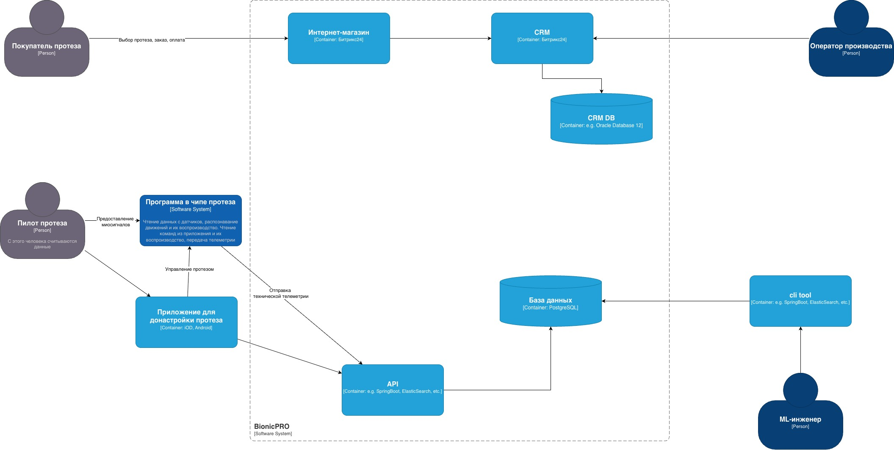

### TO BE
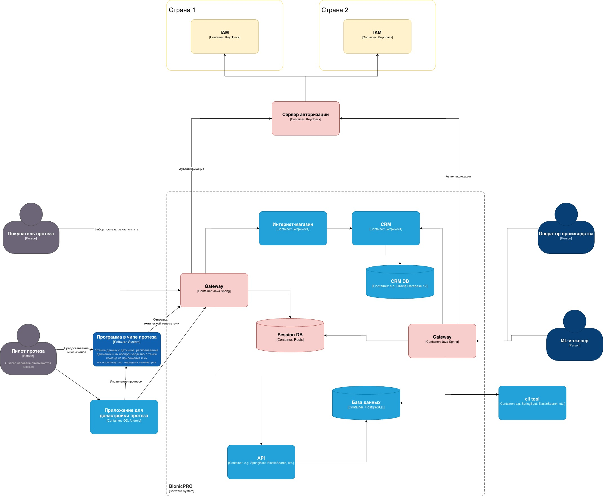

### Задача 2. Улучшите безопасность существующего приложения, заменив Code Grant на PKCE.

Доработка файла realm-export.json, добавить атрибут для clients :

```
      {
        "clientId": "reports-frontend",
        ...
        "attributes": {
          "pkce.code.challenge.method": "S256"
        }
      },
```

Доработать App.tsx, включить добавление code_challenge и code_challenge_method в блок initOptions для keycloak:

```
            initOptions={{
                onLoad: 'check-sso',
                pkceMethod: 'S256',  // <--- Включаем PKCE с SHA-256
                flow: 'standard',
                checkLoginIframe: false,
            }}
```

```shell
# Запускаем контейнер
docker compose up -d 

```

Чтобы зайти в админку keycloak:
```shell
# Зайти в контейнер
docker exec -it  architecture-bionicpro-keycloak-1 bash

# Временно отключить HTTPS
/opt/keycloak/bin/kcadm.sh config credentials \
--server http://localhost:8080 \
--realm master --user admin --password admin

# Для всех realms
/opt/keycloak/bin/kcadm.sh update realms/master -s sslRequired=none
/opt/keycloak/bin/kcadm.sh update realms/reports-realm -s sslRequired=none

exit
```

### Задача 3. Обеспечьте безопасное получение и хранение access-и refresh-токенов.

#### Реализован сервис на Java - bionicpro-auth.
Реализованы ендпоинты:
- /login - для аутентификации
- /status - для проверки статуса аутентификации
- /api/report - тестовый отчет для проверки UI и работы бека

#### Доработан файл кейклока:

```
    "accessTokenLifespan": 60,
    "ssoSessionIdleTimeout": 1800,
    "ssoSessionMaxLifespan": 36000,
```
#### Доработано приложнеие по фронтенду:

- интеграции с bionicpro-auth,
- убран механизм получения токенов
- сделано прокидывание на бэкенд сессионной cookie.

#### Тестирование

Удалить папку для БД - postgres-keycloak-data

Перезапустить приложение:
```shell
docker compose down -v 
# Запускаем контейнер
docker compose up --build -d
```

Логи из bionicpro-auth:

Демонстрация:
- проверки токена
- обновления токена
- ротации ИД сессии

```
2026-02-15T20:30:23.491Z  INFO 1 --- [bionicpro-auth] : Проверка токена для сессии 15BCAE94657F44F6F5C440028DCD8FB2

2026-02-15T20:30:23.492Z  INFO 1 --- [bionicpro-auth] : Токен 15BCAE94657F44F6F5C440028DCD8FB2, время жизни Sun Feb 15 20:30:29 UTC 2026

2026-02-15T20:30:31.720Z  INFO 1 --- [bionicpro-auth] : Проверка токена для сессии 15BCAE94657F44F6F5C440028DCD8FB2

2026-02-15T20:30:31.721Z  INFO 1 --- [bionicpro-auth] : Токен 15BCAE94657F44F6F5C440028DCD8FB2, время жизни Sun Feb 15 20:30:29 UTC 2026

2026-02-15T20:30:31.721Z  INFO 1 --- [bionicpro-auth] : Обновляем токен

2026-02-15T20:30:31.723Z  INFO 1 --- [bionicpro-auth] : refreshToken eyJhbGciOiJIUzI1NiIsInR5cCIgOiAiSldUIiwia2lkIiA6ICJjOGIxNzZlYi1hYmJlLTRmOGItYmQxYS02Yjk1YTk1M2Q0NWUifQ.eyJleHAiOjE3NzExODkxNjksImlhdCI6MTc3MTE4NzM2OSwianRpIjoiMTA5YjRhYjItZWJkZS00OTI3LTk0ZjQtZjEwZWE4MmNkMWU2IiwiaXNzIjoiaHR0cDovL2tleWNsb2FrOjgwODAvcmVhbG1zL3JlcG9ydHMtcmVhbG0iLCJhdWQiOiJodHRwOi8va2V5Y2xvYWs6ODA4MC9yZWFsbXMvcmVwb3J0cy1yZWFsbSIsInN1YiI6ImNjZDA1NGI2LTViNTQtNDQxZS1iZjA3LTM3MjE5NTc4ZDVlNSIsInR5cCI6IlJlZnJlc2giLCJhenAiOiJyZXBvcnRzLWZyb250ZW5kIiwic2Vzc2lvbl9zdGF0ZSI6ImEzY2QxYzkzLTc1ODktNGFjOC1iOGZkLWIwM2VjZWEyYzU3YyIsInNjb3BlIjoicHJvZmlsZSBlbWFpbCIsInNpZCI6ImEzY2QxYzkzLTc1ODktNGFjOC1iOGZkLWIwM2VjZWEyYzU3YyJ9.tCRUpEbf_yc0mIFjgXsqLw3_MQhwZikZA_ahS9ZWyKc

2026-02-15T20:30:31.795Z  INFO 1 --- [bionicpro-auth] : newTokens AccessToken eyJhbGciOiJSUzI1NiIsInR5cCIgOiAiSldUIiwia2lkIiA6ICI4Sm5kM2ExOFVsUGljY2ExM180aDZxbXlJTkJ1RU9FSktpX1huRW1Jai00In0.eyJleHAiOjE3NzExODc0OTEsImlhdCI6MTc3MTE4NzQzMSwianRpIjoiYzJiMjgwM2ItNjFiYS00Nzc5LWJiYWQtOTFjMmQzYThkODdhIiwiaXNzIjoiaHR0cDovL2tleWNsb2FrOjgwODAvcmVhbG1zL3JlcG9ydHMtcmVhbG0iLCJzdWIiOiJjY2QwNTRiNi01YjU0LTQ0MWUtYmYwNy0zNzIxOTU3OGQ1ZTUiLCJ0eXAiOiJCZWFyZXIiLCJhenAiOiJyZXBvcnRzLWZyb250ZW5kIiwic2Vzc2lvbl9zdGF0ZSI6ImEzY2QxYzkzLTc1ODktNGFjOC1iOGZkLWIwM2VjZWEyYzU3YyIsImFjciI6IjEiLCJhbGxvd2VkLW9yaWdpbnMiOlsiaHR0cDovL2xvY2FsaG9zdDozMDAwIl0sInJlYWxtX2FjY2VzcyI6eyJyb2xlcyI6WyJ1c2VyIl19LCJzY29wZSI6InByb2ZpbGUgZW1haWwiLCJzaWQiOiJhM2NkMWM5My03NTg5LTRhYzgtYjhmZC1iMDNlY2VhMmM1N2MiLCJlbWFpbF92ZXJpZmllZCI6ZmFsc2UsIm5hbWUiOiJVc2VyIE9uZSIsInByZWZlcnJlZF91c2VybmFtZSI6InVzZXIxIiwiZ2l2ZW5fbmFtZSI6IlVzZXIiLCJmYW1pbHlfbmFtZSI6Ik9uZSIsImVtYWlsIjoidXNlcjFAZXhhbXBsZS5jb20ifQ.PTiQU97hFL6VfBn6ytFyyyCDDNlwlY-Q8cUKOtSTofTod83_IVDvKZuwhfxC6LZyu1o3iDi1u7ZNfZjVKyi6t3gCK4uj0C-BttIfZmohsAFrYHVhHlz7PBvB_aqU1FgzYveit5poqZ3eVk3s9cD7qCZVISvTacOCx3rQELd6bJl6DNFfkeRtqH6AngfqANuS98sNc15KaU-yR68VxHOaLLg7f5DCuwdJx9OqZeDhGRwjltS6Nn7-7B_YznNCk17_uC_roeLKGjI9rEj2eUIa-5JKJc3exctObt0XFPke1KQGxU3CB3n-hNFlMUsJlsDs_3ItqqWeOy6k4wo367yvMQ , RefreshToken eyJhbGciOiJIUzI1NiIsInR5cCIgOiAiSldUIiwia2lkIiA6ICJjOGIxNzZlYi1hYmJlLTRmOGItYmQxYS02Yjk1YTk1M2Q0NWUifQ.eyJleHAiOjE3NzExODkyMzEsImlhdCI6MTc3MTE4NzQzMSwianRpIjoiM2E5MjZiMWUtZTY5OS00M2M0LThhNzQtZDUxODJkOTVhZDViIiwiaXNzIjoiaHR0cDovL2tleWNsb2FrOjgwODAvcmVhbG1zL3JlcG9ydHMtcmVhbG0iLCJhdWQiOiJodHRwOi8va2V5Y2xvYWs6ODA4MC9yZWFsbXMvcmVwb3J0cy1yZWFsbSIsInN1YiI6ImNjZDA1NGI2LTViNTQtNDQxZS1iZjA3LTM3MjE5NTc4ZDVlNSIsInR5cCI6IlJlZnJlc2giLCJhenAiOiJyZXBvcnRzLWZyb250ZW5kIiwic2Vzc2lvbl9zdGF0ZSI6ImEzY2QxYzkzLTc1ODktNGFjOC1iOGZkLWIwM2VjZWEyYzU3YyIsInNjb3BlIjoicHJvZmlsZSBlbWFpbCIsInNpZCI6ImEzY2QxYzkzLTc1ODktNGFjOC1iOGZkLWIwM2VjZWEyYzU3YyJ9.EtUlI4uMDkALssZLXFOoqUY7B583hpq8k6umtIeOkok

2026-02-15T20:30:31.796Z  INFO 1 --- [bionicpro-auth] : Ротация для сессии 15BCAE94657F44F6F5C440028DCD8FB2, новый ИД сессии 580CD863E3A7DEB5C89EEA7134833D6C

2026-02-15T20:30:49.748Z  INFO 1 --- [bionicpro-auth] : Проверка токена для сессии 580CD863E3A7DEB5C89EEA7134833D6C

2026-02-15T20:30:49.749Z  INFO 1 --- [bionicpro-auth] : Токен 580CD863E3A7DEB5C89EEA7134833D6C, время жизни Sun Feb 15 20:31:31 UTC 2026
```

### Задача 4. Добавьте LDAP для возможности получения данных о пользователях представительства BionicPRO в другой стране.

#### Добавим в докер компоус сервис openldap

```
  openldap:
    image: osixia/openldap:latest
    container_name: openldap
    ...
```

Перезапустить приложение:
```shell
docker compose down -v 
# Запускаем контейнер
docker compose up --build -d
```

#### Настраиваем кейклок

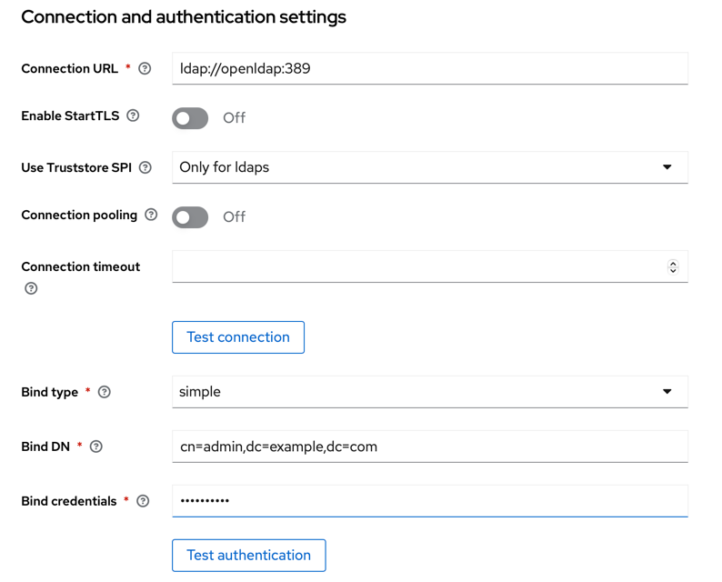
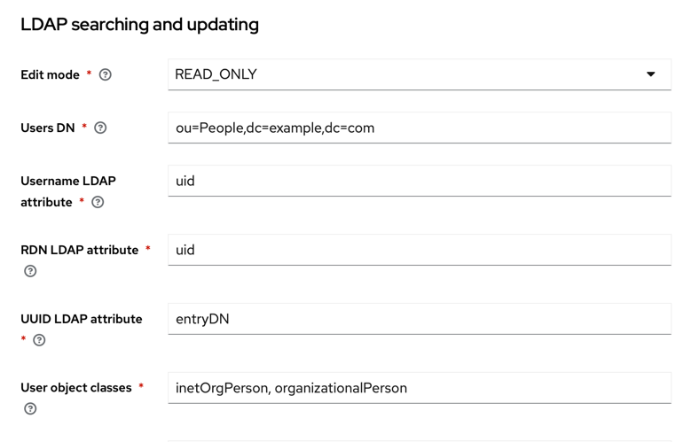

### Задача 5. Настройте MFA

#### Добавляем настройку ОТП

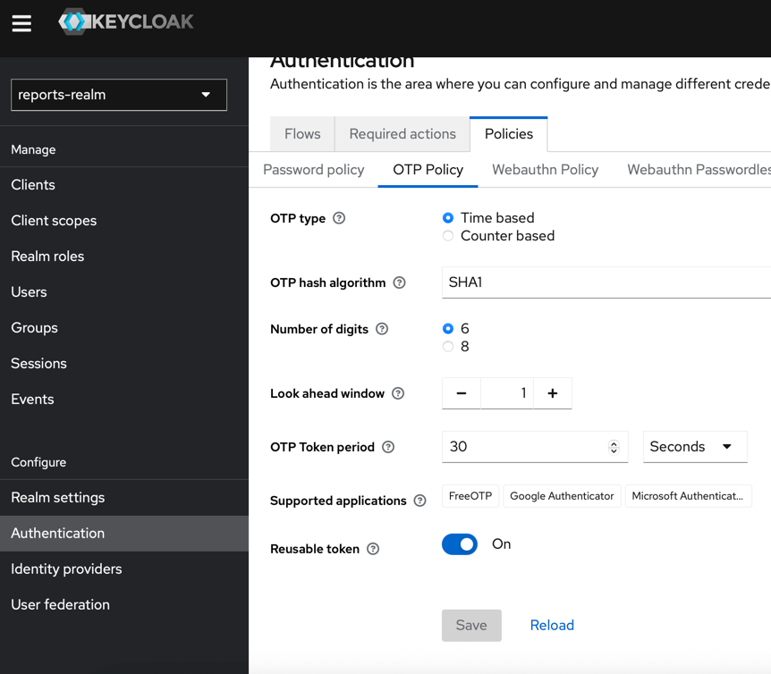

#### Добавляем настройку ОТП для пользователя

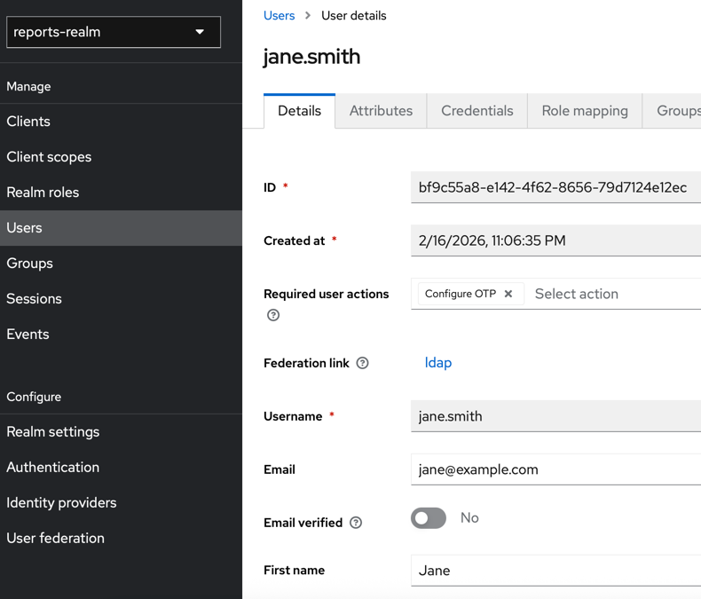

#### Результат при входе

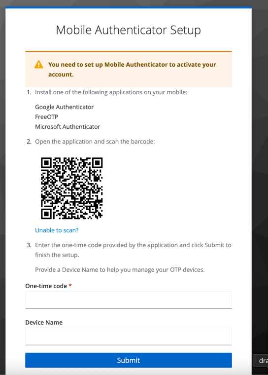

### Задача 6. Добавьте OAuth 2.0 от Яндекс ID.

#### Поменяем кейклок на российский и добавим необходимые библиотеки:
```
  keycloak:
    image: playaru/keycloak-russian:21.1.1
    platform: linux/amd64
    ...
    volumes:
    ...
      - ./keycloak/providers:/opt/keycloak/providers
```

#### Настроим яндекс ID

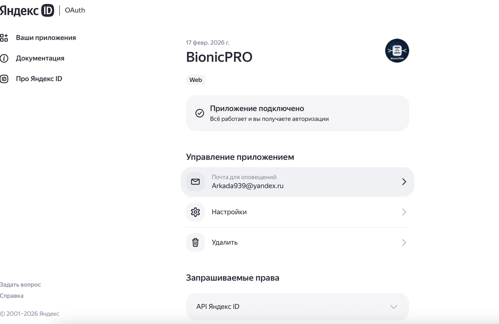

#### Настроим кейклок

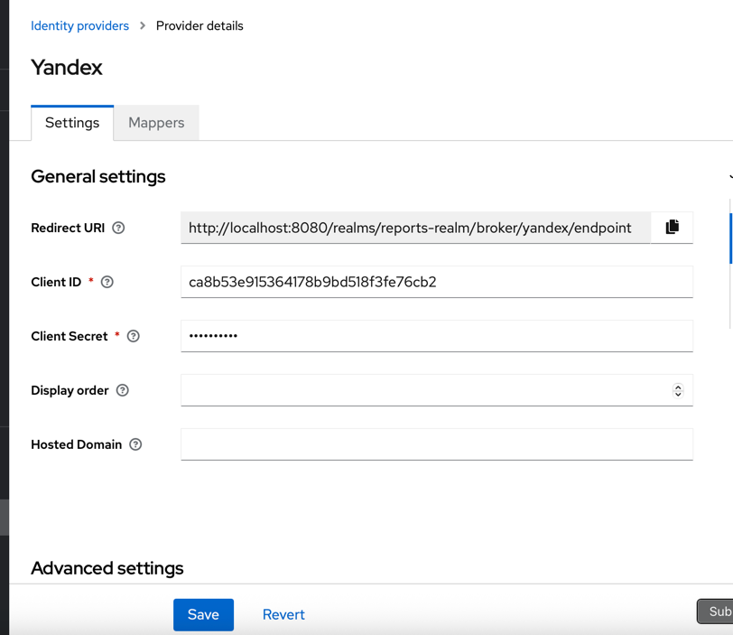

#### Проверка входа

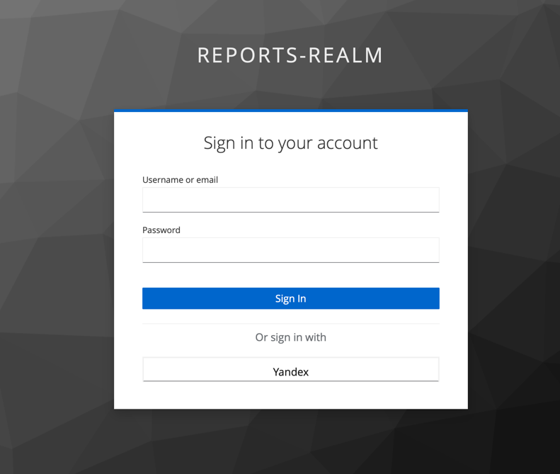
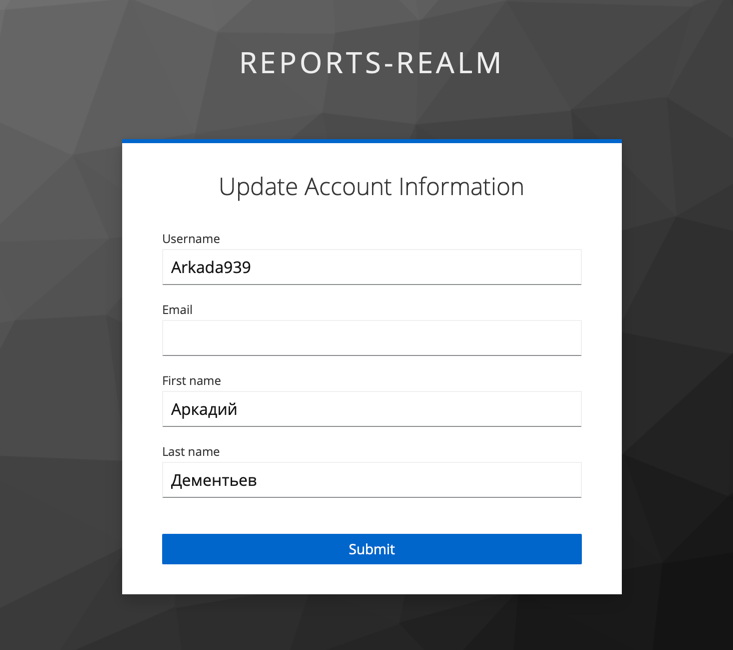

#### Проверка появления пользователя в БД кейклока

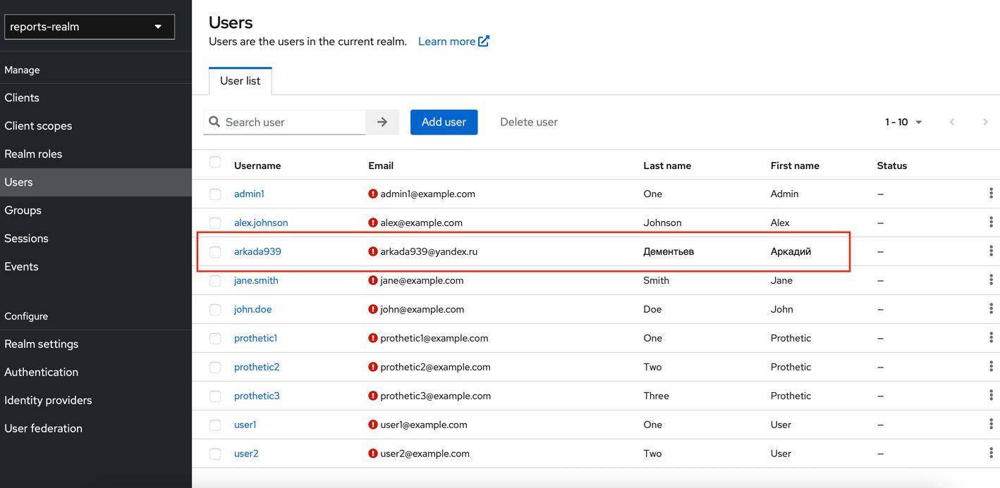

#### Итоговый realm

[realm-export.json](Task1/realm-export.json)


